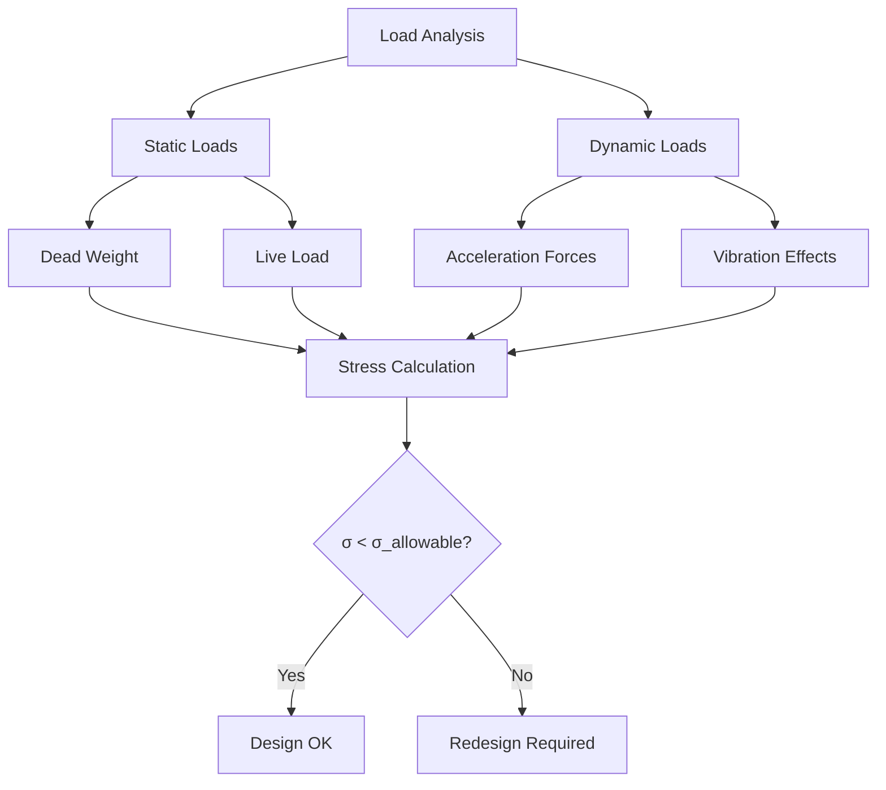

# EDPR811 - Models and Calculations Worksheet

## Automated Waste Sorting System - Engineering Analysis

**Project**: Multi-Sensor Fusion for Automated Recyclable Material Classification  
**Date**: July 25, 2025  
**Author**: Elias Junior Rantsema  

---

## Table of Contents

1. [Electrical Calculations](#1-electrical-calculations)
2. [Mechanical Calculations](#2-mechanical-calculations)
3. [Simulation Requirements](#3-simulation-requirements)
4. [Validation Metrics](#4-validation-metrics)
5. [Results Summary](#5-results-summary)

---

## 1. Electrical Calculations

### 1.1 Power Requirements Analysis

#### Component Power Consumption

| Component | Voltage (V) | Current (A) | Power (W) | Notes |
|-----------|-------------|-------------|-----------|-------|
| Raspberry Pi 4B | 5.0 | _____ | _____ | Peak consumption during CV processing |
| Camera Module | 3.3 | _____ | _____ | Active during image capture |
| Arduino Nano | 5.0 | _____ | _____ | Continuous sensor monitoring |
| Inductive Sensor | 24.0 | _____ | _____ | M18, NPN type |
| Capacitive Sensor | 24.0 | _____ | _____ | M18, analog output |
| Conveyor Motor | 24.0 | _____ | _____ | Variable speed operation |
| Pneumatic Solenoids (4x) | 24.0 | _____ | _____ | Peak activation current |
| LED Lighting | 12.0 | _____ | _____ | 1000 lux illumination |
| **TOTAL SYSTEM** | - | **_____** | **_____** | **Include 20% safety margin** |

#### Power Supply Sizing

**Calculation**:
$$P_{total} = \sum_{i=1}^{n} V_i \times I_i$$

$$SF = 1.2 \text{ 20\% safety margin }$$

$$P_{supply} = P_{total} \times SF$$

**24V Supply Requirements**:
- Continuous Power: _____ W
- Peak Power: _____ W
- Recommended Supply: _____ W, _____ A

**5V Supply Requirements**:
- Continuous Power: _____ W
- Peak Power: _____ W
- Recommended Supply: _____ W, _____ A

### 1.2 Sensor Calibration Calculations

#### Inductive Sensor Characteristics

**Operating Frequency**: _____ kHz  
**Detection Range**: 0-8 mm  
**Target Materials**: Ferrous and non-ferrous metals

**Threshold Calculations**:
$$V_{threshold,ferrous} = \text{⠀⠀⠀⠀⠀ V at ⠀⠀⠀⠀⠀ mm distance}$$

$$V_{threshold,non-ferrous} = \text{⠀⠀⠀⠀⠀ V at ⠀⠀⠀⠀⠀ mm distance}$$

$$V_{noise} = \text{⠀⠀⠀⠀⠀ V}$$

$$V_{margin} = \text{⠀⠀⠀⠀⠀ V}$$

**Material Response Analysis**:
| Material | Distance (mm) | Sensor Output (V) | Classification |
|----------|---------------|-------------------|----------------|
| Steel Can | 2 | _____ | Ferrous |
| Aluminum Can | 2 | _____ | Non-ferrous |
| Copper Wire | 2 | _____ | Non-ferrous |
| No Target | 8 | _____ | Background |

#### Capacitive Sensor Characteristics

**Sensitivity Range**: 5-15 mm  
**Output**: 0-10V analog  
**Target Materials**: Glass, plastic, paper

**Dielectric Constant Reference**:
- Air: $\varepsilon_r = 1.0$
- Paper: $\varepsilon_r = 2-3$
- Plastic (PET): $\varepsilon_r = 3.2$
- Plastic (HDPE): $\varepsilon_r = 2.3$
- Glass: $\varepsilon_r = 5-8$

**Calibration Points**:
$$V_{air}(\varepsilon_r = 1.0) = \text{⠀⠀⠀⠀⠀ V}$$

$$V_{paper}(\varepsilon_r = 2.5) = \text{⠀⠀⠀⠀⠀ V}$$

$$V_{plastic}(\varepsilon_r = 3.0) = \text{⠀⠀⠀⠀⠀ V}$$

$$V_{glass}(\varepsilon_r = 6.0) = \text{⠀⠀⠀⠀⠀ V}$$

**Threshold Calculations**:
$$V_{paper} = \text{⠀⠀⠀⠀⠀ V} \pm \text{⠀⠀⠀⠀⠀ V}$$

$$V_{plastic} = \text{⠀⠀⠀⠀⠀ V} \pm \text{⠀⠀⠀⠀⠀ V}$$

$$V_{glass} = \text{⠀⠀⠀⠀⠀ V} \pm \text{⠀⠀⠀⠀⠀ V}$$

### 1.3 Signal Processing Requirements

#### Sampling Rate Analysis

**Target Processing Time**: < 100 ms per item  
**Conveyor Speed**: 50-200 mm/s  
**Object Size**: 10-100 mm

**Calculation**:
$$t_{detection} = \frac{L_{object}}{v_{conveyor}}$$

$$f_{sampling,min} = \frac{1}{t_{processing} \times SF}$$

where:
- $L_{object}$ = Object length (mm)
- $v_{conveyor}$ = Conveyor speed (mm/s)
- $t_{processing}$ = Processing time constraint (s)
- $SF$ = Safety factor

**Required Sampling Rates**:
- Inductive Sensor: _____ Hz
- Capacitive Sensor: _____ Hz
- Camera Frame Rate: _____ FPS

#### Digital Filtering

**Moving Average Filter**:
$$y[n] = \frac{1}{N} \sum_{k=0}^{N-1} x[n-k]$$

$$f_c = \frac{f_s}{2\pi N}$$

$$\text{Delay} = \frac{N-1}{2f_s}$$

where:
- $N$ = Window size (samples)
- $f_s$ = Sampling frequency (Hz)
- $f_c$ = Cut-off frequency (Hz)

**Noise Analysis**:
$$SNR = 20 \log_{10}\left(\frac{V_{signal}}{V_{noise}}\right) \text{ dB}$$

$$V_{min} = V_{noise} \times 10^{SNR_{min}/20}$$

### 1.4 Communication Protocol Analysis

#### I²C Bus Specifications

**Clock Frequency**: _____ kHz  
**Data Rate**: _____ kbps  
**Number of Devices**: _____

**Timing Calculations**:
$$t_{transmission} = \frac{N_{bits}}{f_{clock}} \times N_{devices}$$

$$t_{scan} = \sum_{i=1}^{n} t_{transmission,i}$$

$$t_{available} = t_{cycle} - t_{scan}$$

where:
- $N_{bits}$ = Data bits per transaction
- $f_{clock}$ = I²C clock frequency (Hz)
- $N_{devices}$ = Number of connected devices
- $t_{cycle}$ = System cycle time (s)

#### Serial Communication (Arduino ↔ Raspberry Pi)

**Baud Rate**: _____ bps  
**Data Packet Size**: _____ bytes  
**Transmission Frequency**: _____ Hz

---

## 2. Mechanical Calculations

### 2.1 Conveyor System Design

#### Belt Speed Optimization

**Target Throughput**: 5-10 items/minute  
**Belt Length**: 500 mm  
**Material Spacing**: _____ mm

**Speed Calculations**:
$$\text{Items per second} = \frac{\text{Target throughput}}{60}$$

$$v_{belt} = (L_{material} + S_{spacing}) \times \text{Items per second}$$

$$v_{optimal} = \text{⠀⠀⠀⠀ to ⠀⠀⠀⠀ mm/s}$$

**Motor Requirements**:
$$m_{total} = m_{belt} + m_{load}$$

$$\tau_{required} = J \alpha + \tau_{friction}$$

$$P_{motor} = \tau_{required} \times \omega$$

where:
- $L_{material}$ = Average material length (mm)
- $S_{spacing}$ = Spacing between materials (mm)
- $J$ = Moment of inertia (kg⋅m²)
- $\alpha$ = Angular acceleration (rad/s²)
- $\omega$ = Angular velocity (rad/s)

#### Belt Tension Analysis

**Belt Material**: _____  
**Pulley Diameter**: _____ mm  
**Wrap Angle**: _____ degrees

**Tension Calculations**:
$$T_1 = T_2 e^{\mu \beta}$$

$$F_{tensioning} = SF \times (T_1 - T_2)$$

where:
- $T_1$ = Tight side tension (N)
- $T_2$ = Slack side tension (N)
- $\mu$ = Coefficient of friction
- $\beta$ = Wrap angle (radians)
- $SF$ = Safety factor


### 2.2 Pneumatic Ejection System

#### Force Requirements

**Material Properties**:
| Material | Mass (g) | Friction Coeff. | Required Force (N) |
|----------|----------|----------------|--------------------|
| Glass Bottle |  |  |  |
| Aluminum Can |  |  |  |
| Plastic Bottle |  |  |  |
| Paper/Cardboard |  |  |  |

**Pneumatic Calculations**:
$$A_{cylinder} = \pi \left(\frac{D}{2}\right)^2$$

$$F_{theoretical} = P \times A_{cylinder}$$

$$F_{actual} = F_{theoretical} \times \eta$$

where:
- $D$ = Cylinder diameter (mm)
- $P$ = Operating pressure (Pa)
- $\eta$ = Efficiency factor

**Air Consumption**:
$$V_{cylinder} = A_{cylinder} \times L_{stroke}$$

$$Q_{air} = V_{cylinder} \times f_{cycles} \times \frac{P_{operating}}{P_{atmospheric}}$$

where:
- $L_{stroke}$ = Stroke length (mm)
- $f_{cycles}$ = Cycles per minute
- $Q_{air}$ = Air consumption (L/min)


### 2.3 Structural Analysis

#### Frame Loading

**Static Loads**:
$$W_{total} = W_{conveyor} + W_{motor} + W_{sensors} + W_{materials}$$

**Dynamic Loads**:
$$F_{acceleration} = m \times a$$

$$F_{dynamic} = F_{static} \times (1 + k_{vibration} + k_{impact})$$

where:
- $k_{vibration}$ = Vibration factor
- $k_{impact}$ = Impact factor

#### Stress Analysis

**Material**: Aluminum Extrusion (6061-T6)  
**Yield Strength**: 276 MPa  
**Safety Factor**: 4

**Beam Analysis** (Critical Support Beam):
$$M_{max} = \frac{wL^2}{8} \text{ (uniformly distributed load)}$$

$$\sigma_{max} = \frac{M_{max} \times c}{I}$$

$$\sigma_{allowable} = \frac{\sigma_{yield}}{SF}$$

**Safety Check**: $\sigma_{max} < \sigma_{allowable}$

where:
- $w$ = Distributed load (N/mm)
- $L$ = Beam length (mm)
- $c$ = Distance to extreme fiber (mm)
- $I$ = Moment of inertia (mm⁴)
- $SF$ = Safety factor



### 2.4 Vibratory Feeder Analysis

**Vibration Parameters**

**Amplitude**: $A$ = _____ mm  
**Frequency**: $f$ = _____ Hz  
**Acceleration**: $a = (2\pi f)^2 \times A$ = _____ m/s²

**Material Flow Rate**:
$$v_{material} = k \sqrt{A \times f}$$

$$\dot{m} = \rho \times v_{material} \times A_{cross-section} \times \eta$$

where:
- $k$ = Empirical constant
- $\rho$ = Material bulk density (kg/m³)
- $A_{cross-section}$ = Feeder cross-sectional area (m²)
- $\eta$ = Feed efficiency

---

## 3. Simulation Requirements

### 3.1 Electrical Simulations

#### 3.1.1 Circuit Simulation (LTspice/Proteus)

**Power Distribution Network**:
- [ ] 24V rail stability under load variations
- [ ] 5V rail regulation during peak consumption
- [ ] Ripple analysis and filtering effectiveness
- [ ] Transient response to pneumatic activation

**Sensor Signal Conditioning**:
- [ ] Amplifier gain and bandwidth analysis
- [ ] Noise filtering performance
- [ ] ADC resolution and quantization effects
- [ ] Temperature drift compensation

**Results**:

- Power Supply Regulation: _____ % under full load
- Signal-to-Noise Ratio: _____ dB
- Filter Cut-off Frequency: _____ Hz
- Temperature Coefficient: _____ %/°C


#### 3.1.2 Communication Protocol Simulation

**I²C Bus Analysis**:
- [ ] Clock stretching effects
- [ ] Multi-master arbitration
- [ ] Error detection and recovery
- [ ] Timing margin analysis

**Results**:

- Maximum Bus Utilization: _____ %
- Error Rate: _____ errors/million transactions
- Worst-case Latency: _____ ms

### 3.2 Mechanical Simulations

#### 3.2.1 Finite Element Analysis (SolidWorks/ANSYS)

**Frame Structure Analysis**:
- [ ] Static stress distribution
- [ ] Dynamic vibration modes
- [ ] Fatigue life estimation
- [ ] Deflection under maximum load

**Simulation Parameters**:
```
Mesh Size: _____ mm
Number of Elements: _____
Material Model: Linear Elastic / Nonlinear
Boundary Conditions: _____
```

**Results**:
```
Maximum Stress: _____ MPa (Location: _____)
Maximum Deflection: _____ mm
First Natural Frequency: _____ Hz
Safety Factor: _____
```

#### 3.2.2 Dynamic System Simulation (MATLAB/Simulink)


**Conveyor Dynamics**:
- [ ] Belt speed control response
- [ ] Load disturbance rejection
- [ ] Material tracking accuracy
- [ ] Positioning precision

**Control System Parameters**:
$$G(s) = K_p + \frac{K_i}{s} + K_d s$$

**Performance Metrics**:
$$t_r = \text{Rise time (10\% to 90\%)}$$
$$t_s = \text{Settling time (±2\%)}$$
$$M_p = \text{Maximum overshoot (\%)}$$
$$e_{ss} = \text{Steady-state error (\%)}$$

### 3.3 Sensor Fusion Simulation

#### 3.3.1 Algorithm Performance Testing

**Test Dataset**:
- Glass samples: _____ items
- Metal samples: _____ items
- Plastic samples: _____ items
- Paper samples: _____ items

**Simulation Results**:
| Material | True Positives | False Positives | False Negatives | Accuracy |
|----------|----------------|-----------------|-----------------|----------|
| Glass |  |  |  |  % |
| Metal |  |  |  |  % |
| Plastic |  |  |  |  % |
| Paper |  |  |  |  % |
| **Overall** |  |  |  | % |

#### 3.3.2 Confusion Matrix Analysis


**Confusion Matrix**:
$$\text{Accuracy} = \frac{TP + TN}{TP + TN + FP + FN}$$

$$\text{Precision} = \frac{TP}{TP + FP}$$

$$\text{Recall} = \frac{TP}{TP + FN}$$

$$\text{F1-Score} = 2 \times \frac{\text{Precision} \times \text{Recall}}{\text{Precision} + \text{Recall}}$$

| Predicted →    | Glass | Metal | Plastic | Paper |
|----------------|-------|-------|---------|-------|
| **Actual ↓**   |       |       |         |       |
| Glass          |  |  |    |  |
| Metal          |  |  |    |  |
| Plastic        |  |  |    |  |
| Paper          |  |  |    |  |

### 3.4 Computer Vision Pipeline Simulation

#### 3.4.1 YOLOv5-nano Performance

**Model Specifications**:
- Input Resolution: 640×640 pixels
- Model Size: 6.5 MB
- Quantization: INT8

**Performance Metrics**:
$$t_{inference} = \text{Model forward pass time (ms)}$$

$$FPS = \frac{1000}{t_{inference}}$$

$$\text{CPU Utilization} = \frac{t_{processing}}{t_{total}} \times 100\%$$

**Accuracy Analysis**:
$$mAP@0.5 = \frac{1}{N} \sum_{i=1}^{N} AP_i \text{ at IoU = 0.5}$$

$$\text{Precision} = \frac{TP}{TP + FP}$$

$$\text{Recall} = \frac{TP}{TP + FN}$$

$$\text{F1-Score} = \frac{2 \times \text{Precision} \times \text{Recall}}{\text{Precision} + \text{Recall}}$$

#### 3.4.2 Environmental Condition Testing

**Lighting Variations**:
| Condition | Lux Level | Accuracy Drop |
|-----------|-----------|---------------|
| Optimal | 1000 | 0% (baseline) |
| Low Light | 500 |  % |
| High Light | 2000 |  % |
| Uneven | Variable |  % |

**Material Condition Effects**:
| Condition | Accuracy Impact |
|-----------|-----------------|
| Clean | 0% (baseline) |
| Dirty |  % |
| Wet |  % |
| Damaged |  % |

---

## 4. Validation Metrics

### 4.1 System Performance Targets

#### Primary Metrics

| Metric | Target | Calculated | Status |
|--------|--------|------------|--------|
| Overall Accuracy | ≥85% |  % | ✓/✗ |
| Metal Detection | ≥95% |  % | ✓/✗ |
| Non-metal Classification | ≥85% |  % | ✓/✗ |
| False Positive Rate | <5% |  % | ✓/✗ |
| Processing Time | <100ms |  ms | ✓/✗ |
| Throughput | 5-10 items/min |  items/min | ✓/✗ |
| System Uptime | ≥95% |  % | ✓/✗ |

#### Secondary Metrics

| Metric | Target | Calculated | Status |
|--------|--------|------------|--------|
| Power Consumption | <50W |  W | ✓/✗ |
| Calibration Stability | <2% drift/8hr | % | ✓/✗ |
| Temperature Range | 18-25°C |  °C | ✓/✗ |
| Humidity Tolerance | <60% RH |  % | ✓/✗ |

### 4.2 Safety and Reliability

#### Electrical Safety

- [ ] Ground fault protection
- [ ] Overcurrent protection
- [ ] Emergency stop functionality
- [ ] Proper isolation and shielding

#### Mechanical Safety

- [ ] Guard rails and covers
- [ ] Emergency stop mechanisms
- [ ] Pinch point protection
- [ ] Pneumatic pressure relief

#### Reliability Analysis

**Mean Time Between Failures (MTBF)**:
$$\lambda_{system} = \sum_{i=1}^{n} \lambda_i$$

$$MTBF = \frac{1}{\lambda_{system}}$$

$$R(t) = e^{-\lambda_{system} \times t}$$

where:
- $\lambda_i$ = Failure rate of component $i$ (failures/hour)
- $R(t)$ = Reliability function at time $t$
- $t$ = Operating time (hours)

**Component Failure Rates**:
- Raspberry Pi: $\lambda_1$ = _____ failures/hour
- Sensors: $\lambda_2$ = _____ failures/hour  
- Mechanical: $\lambda_3$ = _____ failures/hour


---

## 5. Results Summary

### 5.1 Design Verification

#### Electrical System

**Power Supply Design**:
- 24V Supply: _____ W capacity (_____ % utilization)
- 5V Supply: _____ W capacity (_____ % utilization)
- Efficiency: _____ %
- Thermal Management: _____ °C rise

**Sensor Performance**:
- Inductive Detection Range: _____ mm (metals)
- Capacitive Sensitivity: _____ V/εᵣ unit
- Signal Processing Latency: _____ ms
- Calibration Repeatability: _____ %

#### Mechanical System

**Structural Integrity**:
- Maximum Stress: _____ MPa (Safety Factor: _____)
- Maximum Deflection: _____ mm
- Natural Frequency: _____ Hz (above operating range)
- Fatigue Life: _____ cycles

**Pneumatic Performance**:
- Available Force: _____ N
- Response Time: _____ ms
- Air Consumption: _____ L/min
- Reliability: _____ % success rate

### 5.2 Performance Summary

#### Classification Accuracy

$$\text{Overall Accuracy} = \frac{\sum_{i=1}^{n} TP_i}{\sum_{i=1}^{n} (TP_i + FP_i + FN_i)} \times 100\%$$

**Material-Specific Performance**:
- Ferrous Metals: _____ % (Target: ≥95%)
- Non-ferrous Metals: _____ % (Target: ≥95%)  
- Glass: _____ % (Target: ≥85%)
- Plastic: _____ % (Target: ≥85%)
- Paper/Cardboard: _____ % (Target: ≥85%)

**Error Analysis**:
$$\text{False Positive Rate} = \frac{FP}{FP + TN} \times 100\%$$

$$\text{False Negative Rate} = \frac{FN}{FN + TP} \times 100\%$$

$$\text{Classification Confidence} = \frac{1}{N} \sum_{i=1}^{N} P_{max,i}$$

where $P_{max,i}$ is the maximum probability for sample $i$.

#### Operational Performance

$$\text{Throughput} = \frac{N_{items}}{t_{period}} \text{ items/minute}$$

$$\text{Processing Efficiency} = \frac{t_{actual}}{t_{theoretical}} \times 100\%$$

$$\text{System Uptime} = \frac{t_{operational}}{t_{total}} \times 100\%$$

$$\text{Power Efficiency} = \frac{P_{useful}}{P_{total}} \times 100\%$$

### 5.3 Design Optimization Recommendations

#### Electrical Improvements

1. **Power Management**:
   - [ ] Implement sleep modes for idle components
   - [ ] Optimize voltage regulation efficiency
   - [ ] Add power monitoring and alerts

2. **Signal Processing**:
   - [ ] Increase ADC resolution for better sensitivity
   - [ ] Implement adaptive filtering algorithms
   - [ ] Add temperature compensation

#### Mechanical Enhancements

1. **Structural Design**:
   - [ ] Reduce weight while maintaining strength
   - [ ] Add vibration dampening
   - [ ] Improve accessibility for maintenance

2. **Pneumatic System**:
   - [ ] Optimize cylinder sizing for material types
   - [ ] Add position feedback for verification
   - [ ] Implement pressure regulation

#### Software Optimizations

1. **Algorithm Improvements**:
   - [ ] Implement adaptive thresholding
   - [ ] Add online learning capabilities
   - [ ] Optimize for edge computing performance

2. **System Integration**:
   - [ ] Improve sensor fusion algorithms
   - [ ] Add predictive maintenance features
   - [ ] Enhance user interface and monitoring

---

## 6. Conclusions and Future Work

**Met Requirements**:
- [ ] Overall accuracy target (≥85%)
- [ ] Metal detection performance (≥95%)
- [ ] Processing time constraint (<100ms)
- [ ] Power consumption limit (<50W)
- [ ] Safety and reliability standards

**Areas for Improvement**:
- _____ 
- _____ 
- _____ 

