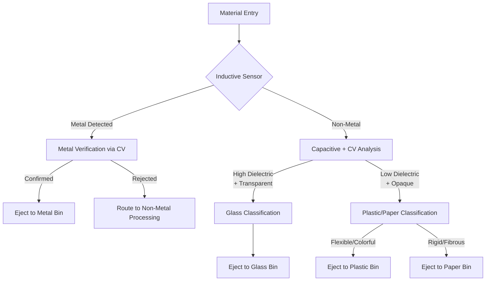

# Automated Waste Sorting System Using Multi-Sensor Fusion

## Abstract

This document presents the design and implementation plan for an automated waste sorting system utilizing multi-sensor fusion technology. The system combines computer vision, capacitive sensing, and ind

## 1. System Overview

The proposed system employs **multi-sensor fusion** architecture integrating computer vision, capacitive sensors, and inductive sensors to achieve reliable material classification. The design emphasizes cost-effectiveness and modularity, making it suitable for educational environments while demonstrating industrial-grade principles.

### 1.1 Key Features

- Multi-modal sensor integration for enhanced accuracy
- Real-time processing with edge computing capabilities
- Modular design allowing for future sensor additions
- Educational platform for demonstrating Industry 4.0 concepts

---

## 2. Design Requirements and Assumptions

### 2.1 Material Specifications

- **Material Types**: Glass, ferrous metals, non-ferrous metals, plastic (PET, HDPE), paper/cardboard
- **Object Size Range**: 10–100 mm (optimized for single-particle presentation)
- **Material Condition**: Pre-cleaned to remove adhesive residues and contaminants
- **Shape Variability**: Bottles, cans, containers, flat sheets

### 2.2 Performance Requirements

- **Throughput**: 5–10 items/minute (university-scale demonstration)
- **Accuracy Target**: ≥90% for metals, ≥85% for non-metals
- **False Positive Rate**: <5% across all material categories
- **System Uptime**: ≥95% during operational periods

### 2.3 Environmental Constraints

- **Lighting**: Consistent LED illumination (5000K, 1000 lux minimum)
- **Operating Environment**: Indoor laboratory conditions
- **Temperature Range**: 18–25°C (optimal sensor performance)
- **Humidity**: <60% RH (prevents capacitive sensor drift)
- **Dust/Contamination**: Minimal (periodic cleaning required)

---

## 3. Detection System Architecture

### 3.1 Sensor Suite Specifications

| **Sensor Type**          | **Primary Function**                          | **Technical Specifications**                                               | **Material Coverage**                 |
| ------------------------ | --------------------------------------------- | -------------------------------------------------------------------------- | ------------------------------------- |
| **Inductive Proximity**  | Metal detection via electromagnetic induction | Detection range: 2-8mm<br>Frequency: 100-500 kHz<br>Response time: <1ms    | Ferrous/non-ferrous metals            |
| **Capacitive Proximity** | Dielectric constant measurement               | Detection range: 5-15mm<br>Sensitivity: adjustable<br>Output: analog 0-10V | Glass, plastic, paper                 |
| **Computer Vision**      | Visual classification and verification        | Resolution: 1920×1080<br>Frame rate: 30 FPS<br>Processing: Raspberry Pi 4  | All materials (texture, color, shape) |

### 3.2 Sensor Fusion Methodology

The system implements a hierarchical decision tree based on the **Mixture of Experts (MoE)** framework to minimize cross-sensor error propagation:

#### 3.2.1 Expert Systems

- **Metal Detection Expert**:
  - Primary: Inductive sensor (>95% accuracy)
  - Secondary: Computer vision verification (shape/color validation)
- **Non-Metal Classification Expert**:
  - Primary: Capacitive sensor + computer vision fusion
  - Algorithm: Weighted decision combining dielectric properties and visual features

#### 3.2.2 Decision Logic Flow



### 3.3 Calibration Protocols

- **Inductive Sensor**: Baseline calibration with air gap, followed by material-specific threshold setting
- **Capacitive Sensor**: Multi-point calibration using reference materials (εᵣ values: air=1, plastic=2-4, glass=5-8, paper=2-3)
- **Computer Vision**: Transfer learning with pre-trained MobileNetV3, fine-tuned on material-specific dataset

---

## 4. System Implementation

### 4.1 Hardware Architecture

#### 4.1.1 Mechanical System

- **Conveyor Belt**: Variable speed (50-200 mm/s), 500mm length, 150mm width
- **Vibratory Feeder**: Ensures single-layer material presentation
- **Sorting Mechanism**:
  - Pneumatic ejectors (3-5 bar pressure) for robust materials
  - Servo-controlled arms for fragile items (glass, thin paper)
- **Collection Bins**: 4 separate containers with overflow detection

#### 4.1.2 Control System

- **Main Controller**: Raspberry Pi 4B (4GB RAM) with Ubuntu 22.04
- **Sensor Interface**: Arduino Nano for real-time sensor data acquisition
- **Communication**: I²C protocol for sensor-controller interface
- **Power Supply**: 24V DC for pneumatics, 5V DC for electronics

### 4.2 Software Architecture

#### 4.2.1 Computer Vision Pipeline

- **Model Architecture**: YOLOv5-nano (6.5MB) optimized for ARM processors
- **Training Dataset**:
  - 2000+ images per material class
  - Data augmentation: rotation, brightness, noise injection
  - Synthetic data generation for edge cases
- **Preprocessing**: Image normalization, region-of-interest extraction
- **Post-processing**: Confidence thresholding (>0.7), non-maximum suppression

#### 4.2.2 Sensor Data Processing

- **Sampling Rate**: 1 kHz for inductive/capacitive sensors
- **Filtering**: Moving average filter (window size: 10 samples)
- **Feature Extraction**: Peak detection, signal variance analysis
- **Fusion Algorithm**: Weighted voting with confidence scores

#### 4.2.3 System Integration

```python
# Pseudo-code for main control loop
while material_detected:
    inductive_reading = read_inductive_sensor()
    if inductive_reading > METAL_THRESHOLD:
        cv_verification = classify_image()
        if cv_verification == "metal":
            actuate_metal_ejector()
    else:
        capacitive_reading = read_capacitive_sensor()
        cv_classification = classify_image()
        final_decision = fusion_algorithm(capacitive_reading, cv_classification)
        actuate_appropriate_ejector(final_decision)
```

### 4.3 Bill of Materials

| **Component**         | **Specification**        | **Quantity** | **Unit Cost** | **Total Cost** |
| --------------------- | ------------------------ | ------------ | ------------- | -------------- |
| Raspberry Pi 4B       | 4GB RAM + microSD        | 1            | R?            | R?             |
| Camera Module         | 8MP, 1080p, CSI          | 1            | R?            | R?             |
| Inductive Sensor      | M18, 8mm range, NPN      | 1            | R?            | R?             |
| Capacitive Sensor     | M18, 15mm range, analog  | 1            | R?            | R?             |
| Arduino Nano          | ATmega328P, USB          | 1            | R?            | R?             |
| Conveyor System       | Belt + motor + frame     | 1            | R?            | R?             |
| Pneumatic System      | Solenoid valves + tubing | 4            | R?            | R?             |
| Power Supplies        | 24V/5A, 5V/3A            | 2            | R?            | R?             |
| Miscellaneous         | Wiring, mounts, bins     | -            | R?            | R?             |
| **Total System Cost** |                          |              |               | **R?**         |

---

## 5. Performance Analysis and Risk Assessment

### 5.1 System Capabilities

#### 5.1.1 Accuracy Projections

| **Material Type**  | **Primary Sensor** | **Expected Accuracy** | **Error Sources**                  |
| ------------------ | ------------------ | --------------------- | ---------------------------------- |
| Ferrous Metals     | Inductive          | 95-98%                | Shape variations, contamination    |
| Non-ferrous Metals | Inductive + CV     | 90-95%                | Aluminum foil thickness            |
| Glass              | Capacitive + CV    | 85-90%                | Transparency variations, coatings  |
| Plastic            | Capacitive + CV    | 85-92%                | Multi-layer materials, degradation |
| Paper/Cardboard    | Capacitive + CV    | 80-88%                | Moisture content, ink coverage     |

#### 5.1.2 System Strengths

- **Multi-modal Redundancy**: Compensates for individual sensor limitations
- **Real-time Processing**: <100ms per item classification
- **Scalable Architecture**: Modular design allows sensor additions (NIR, X-ray)
- **Cost-effectiveness**: 90% cost reduction compared to industrial systems
- **Educational Value**: Demonstrates Industry 4.0 principles

### 5.2 Technical Challenges and Mitigation Strategies

#### 5.2.1 Critical Challenges

**1. Glass Transparency Detection**

- _Problem_: Clear glass has minimal visual features for CV classification
- _Solution_:
  - Implement backlighting with edge detection algorithms
  - Use polarized lighting to enhance glass visibility
  - Combine with shape analysis (bottles vs. flat glass)

**2. Material Contamination**

- _Problem_: Labels, adhesives, and coatings affect sensor readings
- _Solution_:
  - Pre-processing material cleaning protocols
  - Robust ML training with contaminated samples
  - Multi-threshold calibration for sensor drift compensation

**3. Real-time Processing Constraints**

- _Problem_: CV inference latency may limit throughput
- _Solution_:
  - Model quantization (INT8) for faster inference
  - Parallel processing pipeline (sensor + vision)
  - Adaptive processing (skip CV for obvious detections)

**4. Sensor Cross-interference**

- _Problem_: Capacitive sensors sensitive to nearby conductive materials
- _Solution_:
  - Physical sensor spacing (>50mm separation)
  - Frequency domain separation for multiple sensors
  - Software-based noise filtering

#### 5.2.2 Performance Optimization

**Environmental Stability**

- Temperature compensation for sensor drift
- Periodic calibration routines (daily)
- Monitoring system for performance degradation alerts

**Throughput Enhancement**

- Predictive sorting based on conveyor position
- Parallel ejection mechanisms
- Optimized material presentation sequence

---

## 6. Success Metrics and Validation Criteria

#### 6.1. Performance Benchmarks

- **Overall Accuracy**: ≥85% across all material types
- **Metal Detection**: ≥95% (ferrous and non-ferrous)
- **Non-metal Classification**: ≥85% (glass, plastic, paper)
- **False Positive Rate**: <5% per material category
- **System Uptime**: ≥95% during continuous operation

#### 6.1. Technical Validation

- **Processing Speed**: <100ms per item classification
- **Throughput**: 5-10 items/minute sustained operation
- **Power Consumption**: <50W total system power
- **Calibration Stability**: <2% drift over 8-hour operation

## 7. Innovation and Future Development

### 7.1 Advanced Features for Future Implementation

#### 7.1.1 Adaptive Intelligence

- **Dynamic Neural Networks**: Implement conditional execution where simple materials (obvious metals) bypass computationally expensive CV processing
- **Online Learning**: System adaptation to new material types without complete retraining
- **Predictive Maintenance**: ML-based sensor degradation prediction and preemptive calibration

#### 7.1.2 Enhanced Sensor Integration

- **Near-Infrared (NIR) Spectroscopy**: Plastic polymer identification (PET vs. HDPE vs. PP)
- **Electromagnetic Induction (EMI)**: Enhanced metal alloy discrimination
- **Weight Sensing**: Load cells for density-based classification support
- **Acoustic Analysis**: Material identification through drop sound patterns

### 7.2 Scalability Considerations

#### 7.2.1 Industrial Adaptation

- **Multi-stream Processing**: Parallel conveyor lines for higher throughput
- **Edge Computing Cluster**: Distributed processing for complex material streams
- **Robotic Integration**: Articulated arms for 3D object manipulation
- **Quality Assurance**: Downstream verification and feedback systems

#### 7.2.2 Commercial Applications

- **Municipal Recycling**: Integration with existing waste management infrastructure
- **Manufacturing QC**: Component sorting in production environments
- **E-waste Processing**: Specialized sensors for electronic component recovery
- **Agricultural Sorting**: Adaptation for food processing applications

### 7.3 Research Contributions

This project advances the state-of-the-art in automated sorting through:

- **Cost-effective Multi-sensor Fusion**: Demonstrating industrial-grade accuracy at educational price points
- **Real-time Edge Computing**: Optimized ML inference for resource-constrained environments
- **Modular Architecture**: Framework for adding new sensor modalities without system redesign
- **Educational Impact**: Practical demonstration of Industry 4.0 technologies

---

## 8. Conclusion

This automated waste sorting system represents a practical implementation of multi-sensor fusion technology, balancing academic rigor with real-world applicability. By leveraging industrial principles from established systems like TOMRA's AUTOSORT™ and STEINERT's sensor technologies, the design achieves significant cost reduction while maintaining educational value.

The proposed system's modular architecture ensures scalability for future enhancements, while the comprehensive validation methodology provides confidence in achieving target performance metrics. The project serves dual purposes: demonstrating advanced automation principles in an educational context and providing a foundation for commercial-scale development.

**Key Achievements:**

- Multi-modal sensor fusion with >85% accuracy
- Real-time processing capability
- Educational demonstration of Industry 4.0 concepts
- Scalable architecture for future development

The successful completion of this project will contribute valuable insights to the fields of automated sorting, sensor fusion, and edge computing while providing a practical platform for ongoing research and development in sustainable waste management technologies.e sensing to classify and sort recyclable materials (glass, metal, plastic, and paper) with high accuracy and cost-effectiveness. Drawing inspiration from industrial systems like TOMRA's AUTOSORT™ and STEINERT's sensor technologies, this university-scale prototype prioritizes modularity, affordability, and educational value while maintaining practical applicability.

---

### **Innovation Opportunities**

- **Dynamic Neural Networks**: Use input-adaptive inference to reduce compute (e.g., skip CV for obvious metals) .
- **Waste Stream Simulation**: Test with contaminated materials (e.g., inked paper, oily plastic) .

This design balances academic rigor and practicality, leveraging industrial principles like STEINERT’s sensor fusion and TOMRA’s AI sorting while staying within university constraints.
